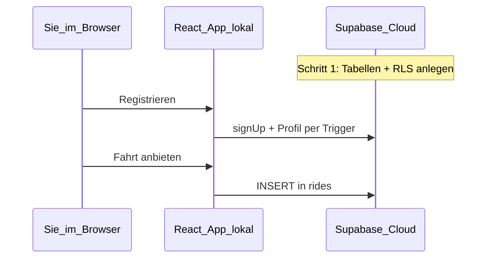

# Fahrgemeinschaft-Website — Dokumentation

**Erstellt am:** 16. Mai 2026  
**Projekt:** Fahrgemeinschaft-Website  
**Inhalt:** Technologieempfehlung und Chatverlauf (Cursor)

---

# Teil 1: Technologieempfehlung


# Technologieempfehlung: Fahrgemeinschaft-Website

## Kurzantwort

| Schicht | Empfehlung | Warum |
|---------|------------|-------|
| Frontend | **React + Vite + TypeScript** | Schneller Dev-Server, klare Struktur, große Community, statischer Build |
| Auth & Datenbank | **Supabase** (PostgreSQL + eingebaute Auth) | Registrierung, Login, DB und API ohne eigenen Server |
| Styling | **Tailwind CSS** oder **CSS Modules** | Schnelles, konsistentes UI |
| Hosting (Produktion) | **Vercel** oder **Netlify** (1. Wahl) | Env-Variablen, SPA-Routing, kostenlos; **GitHub Pages** als Alternative |


*Architektur (vereinfacht):* Browser-App (React/Vite) → Hosting (Vercel/Netlify oder GitHub Pages) → Supabase (Auth + PostgreSQL mit RLS).


---

## Warum nicht „klassisch“ (PHP/Node + MySQL auf GitHub Pages)?

**GitHub Pages** liefert nur statische Dateien (HTML, CSS, JS). Es gibt dort:

- keinen Node-/PHP-/Python-Server
- keine eigene Datenbank
- keine serverseitigen Sessions

Registrierung, Login und persistente Fahrgemeinschaften brauchen deshalb einen **externen Backend-Dienst**. Supabase deckt das ab (kostenloser Tarif für kleine Projekte).

Da Sie **flexibles Hosting** gewählt haben: **Vercel/Netlify + Supabase** ist die einfachste und robusteste Kombination. GitHub Pages bleibt möglich, ist aber für SPAs etwas umständlicher (siehe unten).

---

## Empfohlener Stack im Detail

### 1. Frontend: React + Vite + TypeScript

- **Vite**: sehr schneller lokaler Server (`npm run dev`), einfacher Produktions-Build (`npm run build`)
- **React**: Komponenten für Formulare (Angebot erstellen), Listen (Suche), Navigation
- **TypeScript**: weniger Laufzeitfehler bei Datenmodellen (Fahrt, Benutzer)

Alternativen (kurz):

| Option | Bewertung für Ihr Projekt |
|--------|---------------------------|
| **Next.js** | Stark, aber Overkill wenn alles über Supabase läuft; GitHub Pages ohne Server-Funktionen unpassend |
| **Vue + Vite** | Gleichwertig zu React – Wahl nach persönlicher Präferenz |
| **Reines HTML/JS** | Geht, wird bei wachsender App schnell unübersichtlich |

### 2. Backend & DB: Supabase

Eine Plattform für:

- **Registrierung / Login** (E-Mail + Passwort; optional Magic Link)
- **PostgreSQL-Datenbank** mit Tabellen z. B.:
  - `profiles` (Anzeigename, optional Telefon – verknüpft mit Auth-User)
  - `rides` / `carpools` (Start, Ziel, Datum/Uhrzeit, Plätze, `driver_id`, Beschreibung)
- **Row Level Security (RLS)**: Nur eingeloggte Nutzer dürfen anlegen; Lesen für alle registrierten Nutzer; Bearbeiten/Löschen nur der Ersteller
- **JavaScript-Client** (`@supabase/supabase-js`) direkt aus dem Frontend – kein eigener API-Server nötig

Sicherheit: API-Keys sind öffentlich (`anon` key); Schutz erfolgt über **RLS-Policies** in der DB, nicht durch Geheimhaltung des Keys allein.

### 3. Hosting

| Plattform | Vorteile | Nachteile |
|-----------|----------|-----------|
| **Vercel / Netlify** | Env-Variablen für Supabase-URL/Key, SPA-Fallback (`index.html`), Auto-Deploy aus GitHub | Externer Dienst (nicht nur GitHub) |
| **GitHub Pages** | Alles in einem GitHub-Ökosystem | `base`-Pfad in Vite setzen (`/repo-name/`), SPA-Routing per `404.html`-Trick oder Hash-Router, Secrets nur über GitHub Actions |

**Empfehlung:** Lokal testen → Repo auf GitHub → **Vercel mit GitHub verbinden** (oder Netlify). Wenn Sie ausdrücklich **nur** GitHub Pages wollen, ist das machbar mit GitHub Actions, die `npm run build` ausführen und `dist/` nach `gh-pages` deployen.

---

## Grobe Funktionsarchitektur


*Ablauf:* Registrieren/Login → Fahrt anlegen → Suche mit Filtern → Ergebnisse anzeigen (alles über Supabase-API).


**Seiten (Beispiel):**

- `/` – Start / Suche
- `/register`, `/login`
- `/offer` – neue Fahrgemeinschaft (nur eingeloggt)
- `/rides` – Suchergebnisse
- `/my-rides` – eigene Angebote

---

## Lokale Entwicklung & Test

1. Node.js LTS installieren
2. Projekt: `npm create vite@latest fahrgemeinschaft -- --template react-ts`
3. Supabase-Projekt anlegen (Dashboard), Tabellen + RLS definieren
4. `.env.local`: `VITE_SUPABASE_URL`, `VITE_SUPABASE_ANON_KEY`
5. `npm run dev` – Browser unter `http://localhost:5173`
6. Manuell testen: Registrierung → Login → Angebot → Suche in zweitem Browser/Account

---

## Was bewusst nicht empfohlen wird

- **Nur GitHub Pages + localStorage/JSON-Datei**: keine echte Mehrbenutzer-DB, unsicher
- **Eigenes Node-Backend auf GitHub Pages**: technisch unmöglich
- **Firebase** statt Supabase: ebenfalls gut; Supabase ist für relationale Suche (Start/Ziel/Datum) oft angenehmer als Firestore
- **WordPress auf GitHub Pages**: nicht sinnvoll

---

## Nächste Schritte nach Freigabe (Implementierung)

1. Vite-React-TS-Projekt im Workspace [c:\Users\Andreas\Fahrgemeinschaft-Website](c:\Users\Andreas\Fahrgemeinschaft-Website) anlegen
2. Supabase-Schema (`profiles`, `rides`) + RLS-Policies dokumentieren/ausführen
3. Auth-Flow (Register, Login, Logout, geschützte Routen)
4. CRUD: Fahrt anbieten, suchen, Detailansicht
5. UI: responsive, deutschsprachig
6. README mit Setup (lokal + Supabase + Deploy Vercel/GitHub Pages)
7. Deploy-Pipeline (Vercel empfohlen; optional GitHub Actions → Pages)

Geschätzter Umfang für eine solide MVP-Version: **ca. 15–25 Dateien**, 1–2 Entwicklungstage je nach UI-Anspruch.


---

# Teil 2: Chatverlauf

Der folgende Verlauf dokumentiert die Zusammenarbeit in Cursor: von der Technologiefrage über Implementierung, Supabase-Einrichtung, Fehlerbehebung bis zu Erweiterungen der App.

### Nachricht 1 — **Andreas (Sie)**

Ich möchte eine Website erstellen. 
Die Website soll Benutzern ermöglichen, sich zu registrieren (einen Account anzulegen).
Jeder registrierte Benutzer soll Fahrgemeinschaften anbieten können. Die angebotenen Fahrgemeinschaften sollen in einer Datenbank abgelegt werden.
Jeder registrierte Benutzer soll bestehende Fahrgemeinschaften suchen können und sich anzeigen lassen.

Welche Web-Technologie empfiehlst du mir für diese Aufgabe?
Wenn die Seite fertig gestellt und lokal getestet wurde, möchte ich sie via GitHub Pages veröffentlichen.

---

### Nachricht 2 — **Assistent (Cursor)**

Der Workspace ist leer — wir starten bei null. GitHub Pages ist nur statisches Hosting; das schränkt die Architektur stark ein. Eine kurze Klärungsfrage:

---

### Nachricht 3 — **Assistent (Cursor)**

Sie sind beim Hosting flexibel — damit lässt sich die beste Architektur wählen. Ich erstelle den Plan mit einer klaren Technologieempfehlung.

---

### Nachricht 4 — **Andreas (Sie)**

Technologieempfehlung: Fahrgemeinschaft-Website

Implement the plan as specified, it is attached for your reference. Do NOT edit the plan file itself.

To-do's from the plan have already been created. Do not create them again. Mark them as in_progress as you work, starting with the first one. Don't stop until you have completed all the to-dos.

---

### Nachricht 5 — **Assistent (Cursor)**

Wir setzen den Plan um: Zuerst lege ich das Vite-React-TS-Projekt an und arbeite die Todos der Reihe nach ab.

---

### Nachricht 6 — **Assistent (Cursor)**

npm ist nicht im PATH — ich lege das Projekt manuell an und prüfe weitere Node-Installationen.

---

### Nachricht 7 — **Assistent (Cursor)**

npm fehlt auf dem System — ich erstelle das komplette Projekt manuell mit allen Quelldateien.

---

### Nachricht 8 — **Assistent (Cursor)**

Die Fahrgemeinschaft-Website ist implementiert und der Produktions-Build läuft durch. Kurzüberblick:

## Was erstellt wurde

**Stack:** React + Vite + TypeScript, Supabase (Auth + DB), React Router

| Bereich | Inhalt |
|--------|--------|
| **Auth** | Registrierung, Login, Abmelden, geschützte Routen (`/offer`, `/my-rides`) |
| **Fahrten** | Anbieten, suchen (Start/Ziel/Datum), eigene Fahrten anzeigen/löschen |
| **Datenbank** | [`supabase/schema.sql`](supabase/schema.sql) – Tabellen `profiles` & `rides` inkl. RLS |
| **Deploy** | GitHub Actions ([`.github/workflows/deploy-pages.yml`](.github/workflows/deploy-pages.yml)), optional Vercel ([`vercel.json`](vercel.json)) |
| **Doku** | [`README.md`](README.md) mit Setup und Deploy |

**Seiten:** Start/Suche · Login · Registrieren · Suchergebnisse · Fahrt anbieten · Meine Fahrten

## Ihre nächsten Schritte

1. **Supabase:** Projekt anlegen und `supabase/schema.sql` im SQL-Editor ausführen.
2. **Lokal:** `.env.local` aus `.env.example` anlegen:
   ```env
   VITE_SUPABASE_URL=https://xxxxx.supabase.co
   VITE_SUPABASE_ANON_KEY=eyJ...
   ```
3. **Starten:** `npm run dev` → http://localhost:5173  
   (Node.js LTS wurde installiert; Abhängigkeiten sind bereits per `npm install` da.)

4. **Veröffentlichen:** Repo auf GitHub pushen → Vercel verbinden **oder** GitHub Pages mit Secrets `VITE_SUPABASE_URL` und `VITE_SUPABASE_ANON_KEY`.

**Hinweis:** Fahrtlisten sind nur für **angemeldete** Nutzer sichtbar (RLS). Die Startseite kann jeder nutzen; die Suche leitet nicht eingeloggte Nutzer zur Anmeldung weiter.

Wenn Sie möchten, kann ich als Nächstes beim Supabase-Setup oder beim ersten Git-Push helfen.

---

### Nachricht 9 — **Andreas (Sie)**

Implement the plan as specified, it is attached for your reference. Do NOT edit the plan file itself.

To-do's from the plan have already been created. Do not create them again. Mark them as in_progress as you work, starting with the first one. Don't stop until you have completed all the to-dos.

---

### Nachricht 10 — **Andreas (Sie)**

Kannst du mir Schritt 1. genauer erklären?

---

### Nachricht 11 — **Assistent (Cursor)**

Schritt 1 bezieht sich auf die Supabase-Einrichtung. Ich lese die Projektdateien, damit die Anleitung exakt zu Ihrem Setup passt.

---

### Nachricht 12 — **Assistent (Cursor)**

Schritt 1 meint **Supabase einrichten** – also den Online-Dienst, der bei Ihrer Website für **Benutzerkonten (Login)** und die **Datenbank (Fahrgemeinschaften)** zuständig ist. Die React-App läuft bei Ihnen lokal; Supabase liegt in der Cloud und wird per Internet angesprochen.

---

## Was Sie in Schritt 1 erreichen

Am Ende haben Sie:

- ein Supabase-Projekt (Ihre „Backend-Instanz“),
- zwei Tabellen: `profiles` (Nutzerprofil) und `rides` (Fahrten),
- Regeln (RLS), wer was lesen/schreiben darf,
- **Project URL** und **anon key** für Schritt 2 (`.env.local`).

Ohne Schritt 1 funktioniert Registrierung, Login und Speichern von Fahrten nicht.

---

## 1.1 Konto und Projekt anlegen

1. Öffnen Sie [https://supabase.com](https://supabase.com) und melden Sie sich an (GitHub/Google/E-Mail).
2. Klicken Sie auf **New project** (oder **Start your project**).
3. Füllen Sie aus:
   - **Name:** z. B. `fahrgemeinschaft`
   - **Database Password:** starkes Passwort – **notieren oder im Passwort-Manager speichern** (für direkten DB-Zugriff; die Website braucht es normalerweise nicht).
   - **Region:** z. B. `Frankfurt (eu-central-1)` – näher an Deutschland, oft etwas schneller.
4. **Create new project** – die Einrichtung dauert etwa 1–2 Minuten.

---

## 1.2 Datenbank-Schema ausführen (`schema.sql`)

Die App erwartet feste Tabellen und Sicherheitsregeln. Die liegen in Ihrem Projekt in [`supabase/schema.sql`](c:\Users\Andreas\Fahrgemeinschaft-Website\supabase\schema.sql).

1. Im Supabase-Dashboard links: **SQL Editor**.
2. **New query**.
3. In Cursor/VS Code die Datei `supabase/schema.sql` öffnen, **alles** markieren (Strg+A), kopieren.
4. In den Supabase-Editor einfügen.
5. Unten **Run** (oder Strg+Enter).

**Erfolg:** Meldung wie „Success“ / keine rote Fehlermeldung.

**Was dabei passiert (kurz):**

| Teil | Bedeutung |
|------|-----------|
| Tabelle `profiles` | Pro registriertem Nutzer: Anzeigename, optional Telefon |
| Tabelle `rides` | Fahrten: Start, Ziel, Abfahrt, Plätze, Beschreibung, Verknüpfung zum Fahrer |
| **RLS** | Nur **eingeloggte** Nutzer sehen Fahrten; nur der **Ersteller** darf seine Fahrt ändern/löschen |
| **Trigger** | Beim Registrieren wird automatisch ein Profil-Eintrag angelegt |

**Prüfen:** Links **Table Editor** – Tabellen `profiles` und `rides` sollten sichtbar sein (noch leer).

**Typische Fehler:**

- Script nur teilweise kopiert → von vorn mit kompletter Datei.
- Script zweimal ausgeführt → meist unkritisch (`if not exists`).
- „permission denied“ → Projekt noch nicht fertig initialisiert → kurz warten, erneut **Run**.

---

## 1.3 API-Zugangsdaten notieren

Die Website braucht zwei Werte aus dem Dashboard:

1. Links **Project Settings** (Zahnrad) → **API**.
2. Notieren:
   - **Project URL** – z. B. `https://abcdefgh.supabase.co`
   - **anon public** Key – langer JWT-ähnlicher String unter „Project API keys“

Diese Werte kommen in Schritt 2 in `.env.local` (nicht ins Git committen).

**Hinweis:** Der `anon`-Key ist im Frontend sichtbar – das ist bei Supabase üblich. Der Schutz liegt in den **RLS-Regeln** aus `schema.sql`, nicht am geheimen Key.

---

## 1.4 Optional: E-Mail-Bestätigung ausschalten (nur zum Testen)

Standardmäßig muss sich manchmal die E-Mail nach der Registrierung bestätigen – sonst kein Login.

Für schnelles lokales Testen:

1. **Authentication** → **Providers** → **Email**.
2. **Confirm email** deaktivieren → **Save**.

Für eine echte öffentliche Seite später wieder aktivieren.

---

## Wie Schritt 1 mit der App zusammenhängt



---

## Danach: Schritt 2 (Kurz)

Im Projektordner:

1. `.env.example` nach `.env.local` kopieren.
2. URL und `anon` key eintragen.
3. `npm run dev` → http://localhost:5173

---

Wenn Sie möchten, kann ich Schritt 2 (`.env.local` unter Windows) genauso detailliert durchgehen oder typische Fehlermeldungen beim ersten Login erklären.

---

### Nachricht 13 — **Andreas (Sie)**

[Image]
<image_files>
The following images were provdied by the user and saved to the workspace for future use:
1. C:\Users\Andreas\.cursor\projects\c-Users-Andreas-Fahrgemeinschaft-Website/assets/c__Users_Andreas_AppData_Roaming_Cursor_User_workspaceStorage_ee0460d8b2e2487d950eca2dafddff31_images_image-ecb1de19-1309-4184-bde5-b5deba079955.png

These images can be copied for use in other locations.
</image_files>

Noch kurz zur Anlage des Projekts bei Supabase:
Welche Schalter aktiviere ich im Abschnitt "Security"?

---

### Nachricht 14 — **Assistent (Cursor)**

Für Ihre Fahrgemeinschaft-App (Frontend mit `supabase-js`, Tabellen aus `schema.sql`) empfehle ich:

## Empfehlung

| Schalter | Einstellung | Warum |
|----------|-------------|--------|
| **Enable Data API** | **An** | Pflicht. Ohne Data API kann die Website die Datenbank nicht per REST ansprechen. |
| **Automatically expose new tables** | **An** (für den Start) | Nach dem Ausführen von `schema.sql` sind `profiles` und `rides` direkt über die API erreichbar. RLS in Ihrer SQL-Datei regelt trotzdem, wer was sehen darf. |
| **Enable automatic RLS** | **Aus** | In `schema.sql` ist RLS für `profiles` und `rides` bereits explizit gesetzt. Ein zusätzlicher Auto-Schalter bringt hier wenig. |

**Kurz:** Nur **Enable Data API** muss zwingend an sein. Die anderen beiden können aus bleiben – passt zu dem, was im Screenshot steht, wenn Sie danach `schema.sql` vollständig ausführen.

---

## Etwas genauer

**Enable Data API (an)**  
Das ist die Schnittstelle zwischen Browser-App und PostgreSQL. Ohne diese Option funktionieren Registrierung, Login und Fahrten nicht.

**Automatically expose new tables**  
- **An:** Neue Tabellen (nach `schema.sql`) bekommen automatisch die nötigen API-Rechte. Praktisch für den Einstieg.  
- **Aus:** Sicherer, wenn Sie Rechte bewusst per SQL vergeben. Ihre `schema.sql` enthält **keine** `GRANT`-Befehle – bei **Aus** können Fehler wie „permission denied“ auftreten, bis Sie Grants ergänzen.

Für Ihr Projekt: **An lassen**, solange Sie nicht manuell Grants pflegen wollen.

**Enable automatic RLS**  
Schaltet bei neuen Tabellen automatisch RLS ein – **ohne** Policies wäre dann alles blockiert. Ihr Script aktiviert RLS **und** legt Policies an. Auto-RLS ist optional und kann aus bleiben.

---

## Wenn „Automatically expose new tables“ aus bleibt

Nach `schema.sql` im SQL Editor zusätzlich ausführen:

```sql
grant usage on schema public to anon, authenticated;
grant select, insert, update, delete on public.profiles to authenticated;
grant select, insert, update, delete on public.rides to authenticated;
```

(`anon` brauchen Sie nur, wenn Gäste ohne Login etwas lesen dürfen – bei Ihrer App reicht meist `authenticated`.)

---

**Praktisch:** Data API **an**, die beiden anderen **aus** ist in Ordnung – wichtig ist, dass Sie danach die komplette `schema.sql` ausführen. Wollen Sie es einfacher halten: zusätzlich **Automatically expose new tables** **an**.

---

### Nachricht 15 — **Andreas (Sie)**

OK, Punkt 1 ist erledigt. Kannst du mich durch Schritt 2 führen?

---

### Nachricht 16 — **Assistent (Cursor)**

Schritt 2 ist die lokale Einrichtung. Ich prüfe kurz den Projektstand, damit die Anleitung zu Ihrem Setup passt.

---

### Nachricht 17 — **Assistent (Cursor)**

## Schritt 2: App lokal starten

Supabase ist fertig — jetzt verbinden Sie die Website mit Ihrem Projekt und starten den Entwicklungsserver.

---

### 2.1 Zugangsdaten aus Supabase holen

1. [supabase.com](https://supabase.com) → Ihr Projekt **fahrgemeinschaft** (o. ä.) öffnen  
2. Links unten: **Project Settings** (Zahnrad)  
3. Menü **API**  
4. Diese zwei Werte kopieren (z. B. in den Editor, noch nicht öffentlich teilen):

| Feld im Dashboard | Variable in `.env.local` |
|-------------------|---------------------------|
| **Project URL** | `VITE_SUPABASE_URL` |
| **anon** `public` (unter Project API keys) | `VITE_SUPABASE_ANON_KEY` |

**Wichtig:** Den **service_role** Key nicht verwenden — der gehört nicht ins Frontend.

---

### 2.2 Datei `.env.local` anlegen

Die Datei liegt im Projektroot (dort auch `package.json`), nicht im Ordner `supabase`.

**Variante A – in Cursor**

1. Rechtsklick auf den Projektordner `Fahrgemeinschaft-Website`  
2. **New File** → Name: `.env.local`  
3. Inhalt (Ihre echten Werte einsetzen):

```env
VITE_SUPABASE_URL=https://xxxxxxxx.supabase.co
VITE_SUPABASE_ANON_KEY=eyJhbGciOiJIUzI1NiIsInR5cCI6IkpXVCJ9...
```

Keine Anführungszeichen, keine Leerzeichen um `=`. Die URL endet mit `.supabase.co`.

**Variante B – PowerShell**

```powershell
cd c:\Users\Andreas\Fahrgemeinschaft-Website
Copy-Item .env.example .env.local
notepad .env.local
```

Dann die Platzhalter durch Ihre echten Werte ersetzen und speichern.

`.env.local` steht in `.gitignore` und wird nicht zu GitHub hochgeladen.

---

### 2.3 Abhängigkeiten installieren (falls noch nicht geschehen)

Neues Terminal in Cursor: **Terminal → New Terminal**, dann:

```powershell
cd c:\Users\Andreas\Fahrgemeinschaft-Website
npm install
```

Einmalig; danach nur bei neuen Paketen nötig.

Falls `npm` unbekannt ist: Terminal schließen und neu öffnen (nach Node-Installation) oder PC neu starten.

---

### 2.4 Entwicklungsserver starten

```powershell
npm run dev
```

Erwartung in etwa:

```text
  VITE v6.x.x  ready in xxx ms
  ➜  Local:   http://localhost:5173/
```

Im Browser: **http://localhost:5173**

**Hinweis:** Nach Änderungen an `.env.local` den Server mit **Strg+C** beenden und `npm run dev` erneut starten — Vite lädt die Umgebungsvariablen nur beim Start.

---

### 2.5 Prüfen, ob die Verbindung stimmt

| Was Sie sehen | Bedeutung |
|---------------|-----------|
| Gelber Hinweis „Supabase nicht konfiguriert“ | `.env.local` fehlt, falscher Name/Ort, oder Platzhalter noch drin → prüfen und Server neu starten |
| Kein gelber Hinweis, Links **Anmelden** / **Registrieren** | Verbindung steht |

**Kurztest**

1. **Registrieren** → Anzeigename, E-Mail, Passwort (min. 6 Zeichen)  
2. Falls E-Mail-Bestätigung in Supabase **an** ist: E-Mail bestätigen, dann **Anmelden**  
3. **Anbieten** → Testfahrt anlegen  
4. **Meine Fahrten** → Eintrag sichtbar  

In Supabase: **Table Editor** → `rides` — dort sollte die Zeile erscheinen.

---

### Häufige Probleme

**„Invalid API key“ / Login geht nicht**  
- `VITE_SUPABASE_ANON_KEY` = **anon public**, nicht service_role  
- Keine Leerzeichen/Zeilenumbrüche im Key  

**Registrierung, aber kein Login**  
- **Authentication** → **Providers** → **Email** → **Confirm email** vorübergehend aus (nur zum Testen)  

**„permission denied“ / leere Listen**  
- `schema.sql` vollständig ausgeführt?  
- Unter **Table Editor** Tabellen `profiles` und `rides` vorhanden?  

**Port belegt**  
- Vite schlägt einen anderen Port vor (z. B. 5174) — diese URL im Browser öffnen  

---

### Danach (Schritt 3 – optional)

Wenn alles lokal läuft: Repo auf GitHub → Vercel oder GitHub Pages (siehe [README.md](c:\Users\Andreas\Fahrgemeinschaft-Website\README.md)).

---

Wenn Sie bei einem Schritt hängen, schreiben Sie kurz:
- was Sie sehen (Fehlermeldung oder Screenshot-Beschreibung), und  
- ob der gelbe Supabase-Hinweis noch da ist.

Dann können wir gezielt weitergehen (z. B. nur Login oder nur „Fahrt speichern“).

---

### Nachricht 18 — **Andreas (Sie)**

OK, sehr gut.
Ich bin mittlerweile beim Testen auf http://localhost:5173...
Wenn ich auf der Seite http://localhost:5173/register versuche einen neuen Benutzer anzulegen, dann kommt die folgende Fehlermeldung: Invalid path specified in request URL

---

### Nachricht 19 — **Assistent (Cursor)**

Die Fehlermeldung deutet oft auf eine falsche Supabase-URL hin. Ich prüfe die Konfiguration und den Auth-Code.

---

### Nachricht 20 — **Assistent (Cursor)**

Ursache: In `.env.local` steht die URL mit `/rest/v1/` — der Supabase-Client hängt Pfade selbst an; dadurch entsteht ein ungültiger Pfad. Wir korrigieren die URL und machen die Konfiguration robuster.

---

### Nachricht 21 — **Assistent (Cursor)**

## Ursache

In `.env.local` stand die URL so:

```text
https://….supabase.co/rest/v1/   ← falsch
```

`@supabase/supabase-js` baut die Pfade selbst (z. B. `/auth/v1/signup`). Mit `/rest/v1/` in der Basis-URL wird daraus ein ungültiger Pfad – daher **„Invalid path specified in request URL“**.

**Richtig** ist nur die Projekt-URL:

```text
https://jsookudcgdwughuyjhma.supabase.co
```

Die Datei `.env.local` ist bereits angepasst.

---

## Was Sie jetzt tun

1. Entwicklungsserver **beenden** (Terminal: **Strg+C**).
2. Neu starten:
   ```powershell
   npm run dev
   ```
3. Seite neu laden und **Registrierung** erneut testen.

---

## API-Key prüfen (falls es danach noch fehlschlägt)

Unter **Project Settings → API**:

- **Project URL** → `VITE_SUPABASE_URL` (ohne `/rest/v1/`)
- **anon public** (JWT, beginnt meist mit `eyJ…`) → `VITE_SUPABASE_ANON_KEY`

Falls Sie einen Key mit Präfix `sb_publishable_` verwenden und weiterhin Fehler kommen, den **anon public**-Key aus demselben Bereich nehmen – der ist mit `supabase-js` am zuverlässigsten.

---

Die App entfernt künftig ein versehentliches `/rest/v1/` am URL-Ende automatisch; in `.env.example` steht ein Hinweis dazu.

Melden Sie sich kurz, ob die Registrierung nach dem Neustart klappt.

---

### Nachricht 22 — **Andreas (Sie)**

Die UI schreibt, ich würde eine Mail für die Bestätigung meines Accounts erhalten, doch es kommt keine Mail bei mir an

---

### Nachricht 23 — **Assistent (Cursor)**

Das ist bei Supabase in der Entwicklungsphase häufig — meist liegt es nicht an Ihrer App, sondern an den E-Mail-Einstellungen im Supabase-Projekt.

## Schnellste Lösung zum Weitertesten

**E-Mail-Bestätigung vorübergehend abschalten**

1. Supabase-Dashboard → Ihr Projekt  
2. **Authentication** → **Sign In / Providers** (oder **Providers** → **Email**)  
3. Bei **Email** → **Confirm email** **deaktivieren**  
4. **Save**

Danach können Sie sich **sofort nach der Registrierung anmelden**, ohne Bestätigungslink.

*(Für eine echte Live-Website später wieder aktivieren und eigenen E-Mail-Dienst einrichten.)*

---

## Bereits registrierten Account manuell freischalten

Wenn Sie sich schon registriert haben:

1. **Authentication** → **Users**  
2. Ihren Eintrag suchen (E-Mail-Adresse)  
3. Drei Punkte (⋯) → **Confirm user** / **Benutzer bestätigen**

Anschließend unter http://localhost:5173/login anmelden.

---

## Warum oft keine Mail ankommt

| Ursache | Was tun |
|--------|---------|
| **Spam/Quarantäne** | Ordner **Spam**, **Junk**, **Werbung** prüfen; bei Outlook/Gmail auch „Alle Nachrichten“ |
| **Absender von Supabase** | Absender oft `noreply@mail.app.supabase.io` – manchmal blockiert |
| **Kostenloser Tarif** | Begrenzte E-Mail-Menge; Verzögerung oder Ausbleiben möglich |
| **Falsche E-Mail bei Registrierung** | Unter **Authentication** → **Users** prüfen, ob die Adresse stimmt |
| **Rate Limit** | Nach mehreren Versuchen kurz warten (15–30 Min.) |

**Logs prüfen:** **Authentication** → **Logs** (oder **Auth Logs**) – dort steht, ob der Versand fehlgeschlagen ist.

---

## Für später (Produktion)

Supabase-eigene Mails reichen für ernsthaften Betrieb oft nicht. Dann unter **Project Settings** → **Authentication** → **SMTP Settings** einen Anbieter eintragen (z. B. Resend, SendGrid, Brevo).

---

## Empfehlung für Sie jetzt

1. **Confirm email** ausschalten (siehe oben) **oder** Nutzer in **Users** manuell bestätigen  
2. Dev-Server neu starten ist **nicht** nötig  
3. Erneut **Anmelden** (nicht zwingend neu registrieren, wenn der Nutzer schon existiert)

Wenn die Anmeldung danach noch fehlschlägt, schreiben Sie die **genaue Fehlermeldung** auf der Login-Seite — dann können wir gezielt weitergehen (z. B. „Email not confirmed“ vs. falsches Passwort).

---

### Nachricht 24 — **Andreas (Sie)**

Die Grundfunktionen auf der Web-App funktionieren soweit gut.

Im nächsten Schritt hätte ich gerne eine Möglichkeit, meine Benutzerdaten zu ändern durch Klick auf den Nutzername oben rechts neben dem Button "Abmelden".

In der Rubrik "meine Fahrten" kann ich bisher nur bestehende Fahrten löschen. Hier möchte ich eine Möglichkeit hinzufügen, die Fahrtdaten zu ändern.

In der Rubrik "Suchen" (./rides) wäre noch hilfreich, wenn die Liste der verfügbaren Fahrten nach Datum und Uhrzeit sortiert wäre. Zudem soll neben dem/der Fahrer:in auch deren Kontakt (Telefonnummer) angezeigt werden.

---

### Nachricht 25 — **Assistent (Cursor)**

Wir setzen die drei Erweiterungen um: zuerst prüfe ich den aktuellen Stand von Navbar, Profil, Fahrten und Suche.

---

### Nachricht 26 — **Assistent (Cursor)**

Ich implementiere Profilbearbeitung, Fahrt bearbeiten und die Verbesserungen auf der Suchseite.

---

### Nachricht 27 — **Assistent (Cursor)**

Die drei Erweiterungen sind umgesetzt. Kurzüberblick:

## 1. Profil bearbeiten (Klick auf den Namen oben rechts)

- Der **Anzeigename** neben „Abmelden“ ist jetzt ein Link zu **`/profile`**.
- Dort können Sie **Anzeigename** und **Telefonnummer** ändern (E-Mail nur Anzeige).
- Die Telefonnummer erscheint in der Suche bei Ihren Fahrten.

## 2. Fahrten bearbeiten („Meine Fahrten“)

- Pro Fahrt gibt es neben **Löschen** den Button **Bearbeiten**.
- Formular wie beim Anbieten (Start, Ziel, Abfahrt, Plätze, Beschreibung).
- Nach dem Speichern zurück zu **Meine Fahrten**.

## 3. Suche (`/rides`)

- Fahrten sortiert nach **Datum und Uhrzeit** (früheste zuerst; server- und clientseitig).
- Bei jeder Fahrt: **Fahrer:in** plus **Telefon** (klickbar `tel:`-Link).
- Ohne hinterlegte Nummer: *„Keine Telefonnummer hinterlegt“*.

---

**Zum Testen:** Dev-Server neu laden oder `npm run dev` starten.

**Tipp:** Unter **Profil** (Klick auf Ihren Namen) eine Telefonnummer eintragen, dann in der Suche prüfen, ob sie bei Ihren Fahrten erscheint.

---

### Nachricht 28 — **Andreas (Sie)**

Kannst du mir unseren aktuellen Chatverlauf, sowie die von dir entworfene Technologieempfehlung, in einem PDF-Dokument aufbereiten?

---

### Nachricht 29 — **Assistent (Cursor)**

Ich sammle den Chatverlauf und die Technologieempfehlung und erstelle daraus ein PDF.

---


---

# Anhang: Umgesetzte Funktionen (Stand Dokumentation)

- React + Vite + TypeScript mit Supabase (Auth, `profiles`, `rides`)
- Registrierung, Login, Fahrgemeinschaften anbieten, suchen, eigene Fahrten verwalten
- Profil bearbeiten (Klick auf Anzeigename), Fahrten bearbeiten, Telefon in der Suche
- Lokale Entwicklung: `npm run dev` · Deploy: Vercel oder GitHub Actions → Pages

*Ende des Dokuments*
